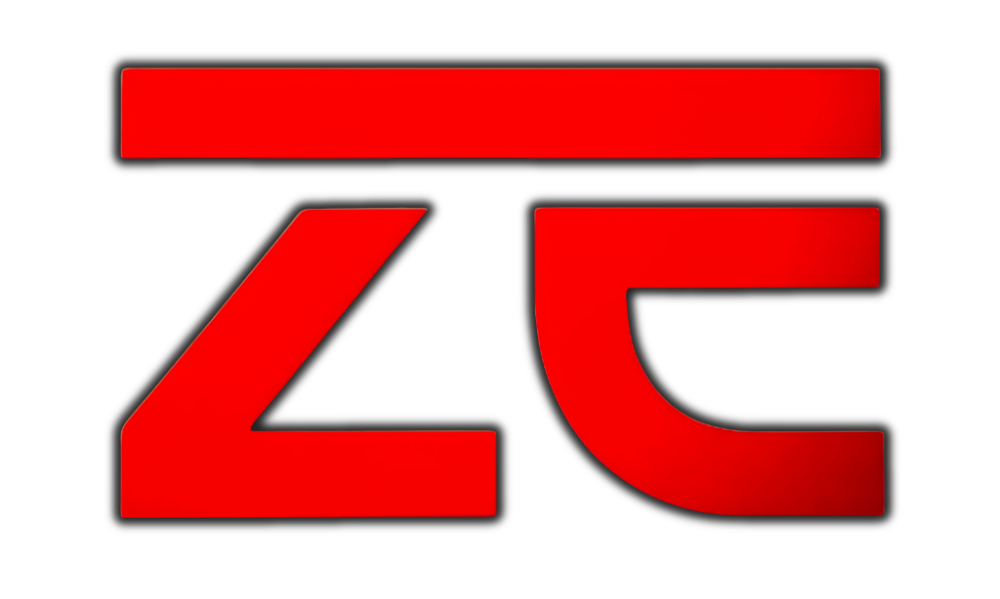

# CareerForm PH — CSC Personal Data Sheet (CS Form 212, Revised 2026) Builder & Government Jobs Portal

<div align="center">
  
  <h3>SITE DEVELOPER BY: <strong>ZETICUZ</strong></h3>
  <p><strong>Free, Private, Client-Side Civil Service Personal Data Sheet Builder & Government Jobs Studio</strong></p>
  <p>
    <a href="https://CareerForm-PH.vercel.app"><strong>Visit Live App: CareerForm-PH.vercel.app</strong></a>
  </p>
</div>

---

## 🌟 Overview

**CareerForm PH** is a modern, high-performance web platform designed specifically for Filipino civil servants, government job seekers, and HR professionals. It provides a complete, 100% private, client-side toolkit for preparing, editing, previewing, and exporting the official **Civil Service Commission Personal Data Sheet (CS Form No. 212, Revised 2026)** and generating tailored government application letters.

Everything runs entirely in your browser — zero personal details, photos, or signatures are ever uploaded to any external server.

---

## 🚀 Key Features & Capabilities

### 1. 📋 Official CSC Form 212 (Revised 2026) Engine
- **Accurate 4-Page Mirror**: Side-by-side live rendering of **Page C1, C2, C3, and C4** matching official CSC typography, line heights, cell borders, and government print dimensions (8 × 14 legal sheet at 100%).
- **Interactive Form Navigation**: Sleek breadcrumb wizard (Personal Information, Family Background, Educational Background, Civil Service Eligibility, Work Experience, Voluntary Work, Learning & Development, Other Information, 40-42 Questionnaire, References, Government ID).
- **Auto-Formatting & Data Masking**:
  - Currency fields automatically format to official currency notation (e.g., `21877` -> `₱21,877.00`).
  - Government IDs (SSS, GSIS, TIN, PhilHealth, Pag-IBIG) auto-format into official delimited masks.
  - Automatic `N/A` fallback prevents leaving blanks that disqualify applications.
  - Real-time validation jumps directly to incomplete fields with visual warning indicators.
- **Smart Date Accomplished Engine**:
  - Adheres strictly to the official CSC Revised 2026 guidelines (full dates e.g. `September 15, 2026`).
  - Independent Page 4 Date Accomplished toggle with live real-time sync across all 4 pages.

### 2. 🖋️ Digital E-Signature Studio
- **Multi-Source Affixing**:
  - **Draw Signature**: Ultra-smooth vector ink drawing with undo, clear, stroke smoothing, and thickness control.
  - **Upload Signature**: Automatic background removal converting paper photos into pure transparent black ink signatures.
  - **Camera Capture**: Integrated webcam capture with intelligent retake, edge detection, and auto-camera shutdown on close/cancel to protect privacy and device resources.
  - **Google Drive Import**: Connect via Google Picker API to pull existing e-signatures.
- **Official Placement**: Signatures are affixed on top of guideline text with pixel-perfect official bounding boxes.

### 3. 🖼️ Passport Photo Studio (Cut-It-Out AI Integration)
- **AI Background Remover**: Powered by `@imgly/background-removal` (Cut-It-Out architecture) executing entirely client-side via WebAssembly/Web Workers.
- **Background Replacer**:
  - CSC Official White Background
  - Standard Government Sky Blue Background
  - Transparent PNG Output
- **HD Image & Pixel Enhancer**: Unsharp-masking, bicubic upscaling, and noise reduction restoring blurry or low-resolution ID photos into sharp, high-definition passport photos.

### 4. 🇵🇭 Government Jobs PH Board (Inspired by govjobsph.com)
- **Jobs Closing Soon Banner**: Red-accented container with countdown alert (`Urgent: Deadlines within 7 days`) highlighting immediate closing vacancies.
- **Metrics Dashboard**: Real-time counters for **Total Active Jobs (61)**, **New Jobs Posted (6)**, and **New This Week (40)**.
- **Strict Navigation Rule**: All cards feature **`View Details`** amber buttons (`#f59e0b`) — no premature "Apply Now" dead ends.
- **New Jobs Today Feed**: Immediate listings from agencies like the Office of Civil Defense (OCD-DND Region 8).
- **Top Hiring Agencies**: Philippine Information Agency (PIA), Department of Environment and Natural Resources (DENR), Jose B. Lingad Memorial General Hospital (JBLMGH), OCD-DND, and National Authority for Child Care (NACC).
- **Browse by Region**: Quick filter pills across all 17 administrative regions (NCR, CAR, BARMM, Regions 1–13).

### 5. 📄 Government Job Details & Application Letter Studio
- **Comprehensive Job Breakdown**:
  - Full Qualification Standards (Education, Training, Experience, Eligibility, Core Competencies).
  - Complete Documents Checklist (Signed application letter, CS Form 212 Revised 2026, WES, TOR/Diploma, Certificates).
  - Addressee Information (Regional Executive Director / Appointing Authority, official office address, hotline, email).
  - CSC Warning Note: *"APPLICATIONS WITH INCOMPLETE DOCUMENTS SHALL NOT BE ENTERTAINED."*
- **Instant Application Letter Studio**:
  - Pre-filled with Position Title, Salary Grade, Item Number, Agency, and Addressee.
  - **3 Tailored Letter Versions**:
    - *Version 1*: Brief and straight to the point.
    - *Version 2*: Professional & Qualifications Focused.
    - *Version 3*: Public Service Commitment & Impact Driven.
  - **Interactive Relevant Skills Pills**: Toggle job-specific skill pills that dynamically weave into letter prose in real-time.
  - **Export Formats**: Instant TXT and print-ready PDF export.
  - **Seamless Workspace Transition**: Closing or proceeding from the Letter Studio automatically routes the user directly into `/builder?position=...&agency=...`.

---

## 📌 Project Tasks & Roadmap Checklist

### Completed Tasks
- [x] Full Civil Service Commission CS Form 212 (Revised 2026) 4-page layout and print generator
- [x] Live PDS Mirror Canvas with real-time responsive scaling and zoom
- [x] Smart Auto-Fill & Validation (SSS, GSIS, TIN, PhilHealth, Pag-IBIG, Phone, Salary Currency formatting)
- [x] Date Accomplished full-word formatting and selective page toggle sync
- [x] Digital E-Signature Studio (Draw, Upload with auto-transparent background, WebCam capture with auto-off)
- [x] Passport Photo Studio with Cut-It-Out AI background remover, background swapper, and HD enhancer
- [x] Government Jobs Board with Closing Soon banner, 3 metrics cards (61/6/40), and Regional pills
- [x] Amber `View Details` card button standard
- [x] Job Details Modal with Qualifications, Documents Needed, How to Apply, and Notes
- [x] Government Application Letter Studio with 3 versions, interactive skill pills, and PDF/TXT export
- [x] Automatic redirection from Application Letter Studio into `/builder` PDS workspace
- [x] CodePen Montserrat font and typography matching
- [x] Developer branding in footer with official ZETICUZ logo and attribution: `SITE DEVELOPER BY: ZETICUZ`
- [x] 100% Client-Side Privacy architecture (no database dependencies, offline capable)
- [x] Next.js 16 App Router build optimization with 0 errors

### Future Tasks & Roadmap
- [ ] CSC Job Portal live RSS / GraphQL automated ingestion
- [ ] Work Experience Sheet (WES Annex) PDF automated merger
- [ ] QR Code verification generation on Page 4 for authenticity checks
- [ ] Offline PWA (Progressive Web App) service worker installation support
- [ ] Multi-dialect user guide (Tagalog, Cebuano, Ilocano)

---

## 🛠️ Tech Stack & Architecture

- **Framework**: Next.js 16 (App Router)
- **UI & Styling**: Tailwind CSS, CSS Grid / Flexbox
- **Icons**: Lucide React
- **Fonts**: Montserrat, Syne, Space Grotesk
- **AI & Image Processing**: `@imgly/background-removal` (WASM / Web Workers), HTML5 Canvas 2D
- **PDF & Export Engine**: Native Browser Print Engine, Vector Canvas Rendering, Blob Streams
- **State Management**: React 19 Client State, LocalStorage Sync

---

## 💻 Local Development Setup

1. **Clone the repository**:
   ```bash
   git clone https://github.com/your-username/CareerForm.git
   cd CareerForm
   ```

2. **Install dependencies**:
   ```bash
   npm install
   ```

3. **Run the development server**:
   ```bash
   npm run dev
   ```

4. **Build for production**:
   ```bash
   npm run build
   npm run start
   ```

---

## 👤 Developer Attribution

- **Developed by**: **ZETICUZ**
- **Website**: [CareerForm PH](https://CareerForm-PH.vercel.app)
- **Developer Attribution**: `SITE DEVELOPER BY: ZETICUZ`

---

## ⚖️ Disclaimer

*CareerForm PH is an independent, open-source productivity tool developed by ZETICUZ for Filipino civil service applicants. It is not officially affiliated with, endorsed by, or operated by the Civil Service Commission (CSC) of the Republic of the Philippines. All trademarks and official forms belong to their respective government entities.*
